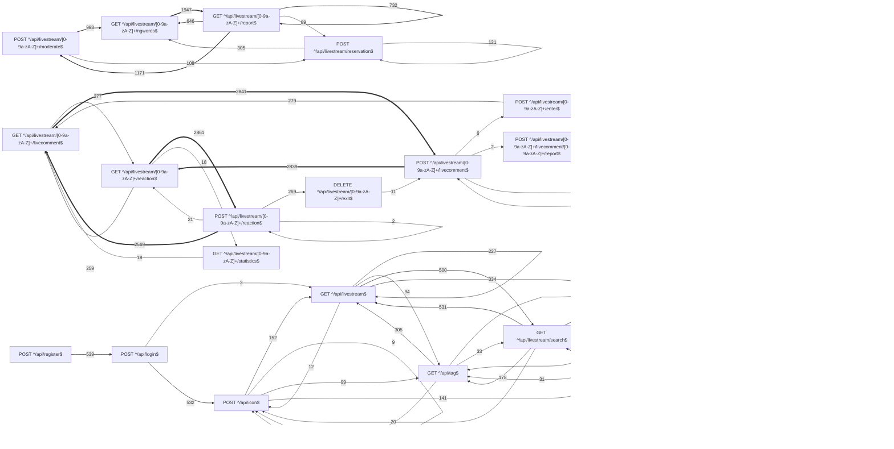

# usertrail

A tool to track users' transitions using session-id stored in Cookie and output result in Mermaid format.

## sample output

```mermaid
graph LR
  9e8533a1-48be-4bb1-a1e7-b50743e5329f["POST ^/api/icon$"] -->|152| ddfa93d2-6d94-4e56-a119-0819b3a964e9["GET ^/api/livestream$"]
  linkStyle 0 stroke-width:1.2px;
  cb9c9d3a-defc-4ce4-aae9-1d18405aec3a["GET ^/api/livestream/[0-9a-zA-Z]+/livecomment$"] -->|277| a6d48cb5-93ae-4e81-af56-c398b3c2e160["GET ^/api/livestream/[0-9a-zA-Z]+/reaction$"]
  linkStyle 1 stroke-width:1.3px;
  ddfa93d2-6d94-4e56-a119-0819b3a964e9["GET ^/api/livestream$"] -->|12| 9e8533a1-48be-4bb1-a1e7-b50743e5329f["POST ^/api/icon$"]
  linkStyle 2 stroke-width:1.0px;
  ddfa93d2-6d94-4e56-a119-0819b3a964e9["GET ^/api/livestream$"] -->|227| ddfa93d2-6d94-4e56-a119-0819b3a964e9["GET ^/api/livestream$"]
  linkStyle 3 stroke-width:1.2px;
  ddfa93d2-6d94-4e56-a119-0819b3a964e9["GET ^/api/livestream$"] -->|94| d9d401a0-bbc8-4eb7-a878-19a1bad1771e["GET ^/api/tag$"]
  linkStyle 4 stroke-width:1.1px;
  64577406-8fd8-4ac0-ac96-ea1fbdd3be98["POST ^/api/livestream/[0-9a-zA-Z]+/livecomment$"] -->|6| 7727e1c0-1861-4663-b80a-56bd0bd2a1c5["POST ^/api/livestream/[0-9a-zA-Z]+/enter$"]
  linkStyle 5 stroke-width:1.0px;
  e8a3065f-1e04-4551-9c71-81204df3dfb2["GET ^/api/user/[0-9a-zA-Z]+/icon$"] -->|31| d9d401a0-bbc8-4eb7-a878-19a1bad1771e["GET ^/api/tag$"]
  linkStyle 6 stroke-width:1.0px;
  64577406-8fd8-4ac0-ac96-ea1fbdd3be98["POST ^/api/livestream/[0-9a-zA-Z]+/livecomment$"] -->|2| 348db902-b239-4eed-bb1e-1426859e9566["POST ^/api/livestream/[0-9a-zA-Z]+/livecomment/[0-9a-zA-Z]+/report$"]
  linkStyle 7 stroke-width:1.0px;
  a6d48cb5-93ae-4e81-af56-c398b3c2e160["GET ^/api/livestream/[0-9a-zA-Z]+/reaction$"] -->|2861| 17f43c4b-9366-4fd1-a56c-2559d89c3745["POST ^/api/livestream/[0-9a-zA-Z]+/reaction$"]
  linkStyle 8 stroke-width:3.9px;
  17f43c4b-9366-4fd1-a56c-2559d89c3745["POST ^/api/livestream/[0-9a-zA-Z]+/reaction$"] -->|269| 16dc70af-ea29-4b11-8a14-2d5dc143862c["DELETE ^/api/livestream/[0-9a-zA-Z]+/exit$"]
  linkStyle 9 stroke-width:1.3px;
  30513139-629f-4b47-b74a-95ff3d22f665["GET ^/api/livestream/search$"] -->|475| e8a3065f-1e04-4551-9c71-81204df3dfb2["GET ^/api/user/[0-9a-zA-Z]+/icon$"]
  linkStyle 10 stroke-width:1.5px;
  17f43c4b-9366-4fd1-a56c-2559d89c3745["POST ^/api/livestream/[0-9a-zA-Z]+/reaction$"] -->|2569| cb9c9d3a-defc-4ce4-aae9-1d18405aec3a["GET ^/api/livestream/[0-9a-zA-Z]+/livecomment$"]
  linkStyle 11 stroke-width:3.6px;
  e8a3065f-1e04-4551-9c71-81204df3dfb2["GET ^/api/user/[0-9a-zA-Z]+/icon$"] -->|28937| e8a3065f-1e04-4551-9c71-81204df3dfb2["GET ^/api/user/[0-9a-zA-Z]+/icon$"]
  linkStyle 12 stroke-width:30.0px;
  16b8c276-63e7-4296-a704-32c32696182a["POST ^/api/livestream/[0-9a-zA-Z]+/moderate$"] -->|998| 27b7b351-ce1d-42bd-957d-5cafeb3de11f["GET ^/api/livestream/[0-9a-zA-Z]+/ngwords$"]
  linkStyle 13 stroke-width:2.0px;
  254fdfa2-f440-4da9-89d3-dc34600fdc8e["GET ^/api/livestream/[0-9a-zA-Z]+/report$"] -->|646| 27b7b351-ce1d-42bd-957d-5cafeb3de11f["GET ^/api/livestream/[0-9a-zA-Z]+/ngwords$"]
  linkStyle 14 stroke-width:1.6px;
  a6d48cb5-93ae-4e81-af56-c398b3c2e160["GET ^/api/livestream/[0-9a-zA-Z]+/reaction$"] -->|18| cb1a2d0d-9500-41cb-9680-30c5758d09db["GET ^/api/livestream/[0-9a-zA-Z]+/statistics$"]
  linkStyle 15 stroke-width:1.0px;
  cd92bc7d-4659-4435-8a8e-ca9049f565f6["POST ^/api/register$"] -->|539| 43626935-4199-42df-bd97-11bfd9aa5711["POST ^/api/login$"]
  linkStyle 16 stroke-width:1.5px;
  8426dcde-97ef-46ca-8187-0c996cd0eb96["POST ^/api/livestream/reservation$"] -->|305| 27b7b351-ce1d-42bd-957d-5cafeb3de11f["GET ^/api/livestream/[0-9a-zA-Z]+/ngwords$"]
  linkStyle 17 stroke-width:1.3px;
  e8a3065f-1e04-4551-9c71-81204df3dfb2["GET ^/api/user/[0-9a-zA-Z]+/icon$"] -->|31| 1cb0e30d-7bbf-4e9c-918f-ff2d740f4c3b["GET ^/api/user/[0-9a-zA-Z]+/theme$"]
  linkStyle 18 stroke-width:1.0px;
  7727e1c0-1861-4663-b80a-56bd0bd2a1c5["POST ^/api/livestream/[0-9a-zA-Z]+/enter$"] -->|279| cb9c9d3a-defc-4ce4-aae9-1d18405aec3a["GET ^/api/livestream/[0-9a-zA-Z]+/livecomment$"]
  linkStyle 19 stroke-width:1.3px;
  16b8c276-63e7-4296-a704-32c32696182a["POST ^/api/livestream/[0-9a-zA-Z]+/moderate$"] -->|108| 8426dcde-97ef-46ca-8187-0c996cd0eb96["POST ^/api/livestream/reservation$"]
  linkStyle 20 stroke-width:1.1px;
  e8a3065f-1e04-4551-9c71-81204df3dfb2["GET ^/api/user/[0-9a-zA-Z]+/icon$"] -->|31| d02efde4-944f-4a00-b28d-2efb5096bd1f["GET ^/api/user/[0-9a-zA-Z]+/statistics$"]
  linkStyle 21 stroke-width:1.0px;
  9e8533a1-48be-4bb1-a1e7-b50743e5329f["POST ^/api/icon$"] -->|9| 9e8533a1-48be-4bb1-a1e7-b50743e5329f["POST ^/api/icon$"]
  linkStyle 22 stroke-width:1.0px;
  8426dcde-97ef-46ca-8187-0c996cd0eb96["POST ^/api/livestream/reservation$"] -->|121| 8426dcde-97ef-46ca-8187-0c996cd0eb96["POST ^/api/livestream/reservation$"]
  linkStyle 23 stroke-width:1.1px;
  17f43c4b-9366-4fd1-a56c-2559d89c3745["POST ^/api/livestream/[0-9a-zA-Z]+/reaction$"] -->|2| 17f43c4b-9366-4fd1-a56c-2559d89c3745["POST ^/api/livestream/[0-9a-zA-Z]+/reaction$"]
  linkStyle 24 stroke-width:1.0px;
  16dc70af-ea29-4b11-8a14-2d5dc143862c["DELETE ^/api/livestream/[0-9a-zA-Z]+/exit$"] -->|11| 64577406-8fd8-4ac0-ac96-ea1fbdd3be98["POST ^/api/livestream/[0-9a-zA-Z]+/livecomment$"]
  linkStyle 25 stroke-width:1.0px;
  cb1a2d0d-9500-41cb-9680-30c5758d09db["GET ^/api/livestream/[0-9a-zA-Z]+/statistics$"] -->|18| cb9c9d3a-defc-4ce4-aae9-1d18405aec3a["GET ^/api/livestream/[0-9a-zA-Z]+/livecomment$"]
  linkStyle 26 stroke-width:1.0px;
  254fdfa2-f440-4da9-89d3-dc34600fdc8e["GET ^/api/livestream/[0-9a-zA-Z]+/report$"] -->|1171| 16b8c276-63e7-4296-a704-32c32696182a["POST ^/api/livestream/[0-9a-zA-Z]+/moderate$"]
  linkStyle 27 stroke-width:2.2px;
  30513139-629f-4b47-b74a-95ff3d22f665["GET ^/api/livestream/search$"] -->|20| 9e8533a1-48be-4bb1-a1e7-b50743e5329f["POST ^/api/icon$"]
  linkStyle 28 stroke-width:1.0px;
  d9d401a0-bbc8-4eb7-a878-19a1bad1771e["GET ^/api/tag$"] -->|93| d9d401a0-bbc8-4eb7-a878-19a1bad1771e["GET ^/api/tag$"]
  linkStyle 29 stroke-width:1.1px;
  d02efde4-944f-4a00-b28d-2efb5096bd1f["GET ^/api/user/[0-9a-zA-Z]+/statistics$"] -->|31| f9404f27-8794-490e-b28b-31a05f9045dc["GET ^/api/user/[0-9a-zA-Z]+/livestream$"]
  linkStyle 30 stroke-width:1.0px;
  f9404f27-8794-490e-b28b-31a05f9045dc["GET ^/api/user/[0-9a-zA-Z]+/livestream$"] -->|31| e8a3065f-1e04-4551-9c71-81204df3dfb2["GET ^/api/user/[0-9a-zA-Z]+/icon$"]
  linkStyle 31 stroke-width:1.0px;
  30513139-629f-4b47-b74a-95ff3d22f665["GET ^/api/livestream/search$"] -->|710| 30513139-629f-4b47-b74a-95ff3d22f665["GET ^/api/livestream/search$"]
  linkStyle 32 stroke-width:1.7px;
  254fdfa2-f440-4da9-89d3-dc34600fdc8e["GET ^/api/livestream/[0-9a-zA-Z]+/report$"] -->|732| 254fdfa2-f440-4da9-89d3-dc34600fdc8e["GET ^/api/livestream/[0-9a-zA-Z]+/report$"]
  linkStyle 33 stroke-width:1.7px;
  cb9c9d3a-defc-4ce4-aae9-1d18405aec3a["GET ^/api/livestream/[0-9a-zA-Z]+/livecomment$"] -->|2841| 64577406-8fd8-4ac0-ac96-ea1fbdd3be98["POST ^/api/livestream/[0-9a-zA-Z]+/livecomment$"]
  linkStyle 34 stroke-width:3.8px;
  a6d48cb5-93ae-4e81-af56-c398b3c2e160["GET ^/api/livestream/[0-9a-zA-Z]+/reaction$"] -->|259| cb9c9d3a-defc-4ce4-aae9-1d18405aec3a["GET ^/api/livestream/[0-9a-zA-Z]+/livecomment$"]
  linkStyle 35 stroke-width:1.3px;
  e8a3065f-1e04-4551-9c71-81204df3dfb2["GET ^/api/user/[0-9a-zA-Z]+/icon$"] -->|779| 30513139-629f-4b47-b74a-95ff3d22f665["GET ^/api/livestream/search$"]
  linkStyle 36 stroke-width:1.8px;
  17f43c4b-9366-4fd1-a56c-2559d89c3745["POST ^/api/livestream/[0-9a-zA-Z]+/reaction$"] -->|21| a6d48cb5-93ae-4e81-af56-c398b3c2e160["GET ^/api/livestream/[0-9a-zA-Z]+/reaction$"]
  linkStyle 37 stroke-width:1.0px;
  64577406-8fd8-4ac0-ac96-ea1fbdd3be98["POST ^/api/livestream/[0-9a-zA-Z]+/livecomment$"] -->|24| 64577406-8fd8-4ac0-ac96-ea1fbdd3be98["POST ^/api/livestream/[0-9a-zA-Z]+/livecomment$"]
  linkStyle 38 stroke-width:1.0px;
  9e8533a1-48be-4bb1-a1e7-b50743e5329f["POST ^/api/icon$"] -->|99| d9d401a0-bbc8-4eb7-a878-19a1bad1771e["GET ^/api/tag$"]
  linkStyle 39 stroke-width:1.1px;
  43626935-4199-42df-bd97-11bfd9aa5711["POST ^/api/login$"] -->|3| ddfa93d2-6d94-4e56-a119-0819b3a964e9["GET ^/api/livestream$"]
  linkStyle 40 stroke-width:1.0px;
  d9d401a0-bbc8-4eb7-a878-19a1bad1771e["GET ^/api/tag$"] -->|33| 30513139-629f-4b47-b74a-95ff3d22f665["GET ^/api/livestream/search$"]
  linkStyle 41 stroke-width:1.0px;
  d9d401a0-bbc8-4eb7-a878-19a1bad1771e["GET ^/api/tag$"] -->|8| 9e8533a1-48be-4bb1-a1e7-b50743e5329f["POST ^/api/icon$"]
  linkStyle 42 stroke-width:1.0px;
  254fdfa2-f440-4da9-89d3-dc34600fdc8e["GET ^/api/livestream/[0-9a-zA-Z]+/report$"] -->|89| 8426dcde-97ef-46ca-8187-0c996cd0eb96["POST ^/api/livestream/reservation$"]
  linkStyle 43 stroke-width:1.1px;
  ddfa93d2-6d94-4e56-a119-0819b3a964e9["GET ^/api/livestream$"] -->|500| 30513139-629f-4b47-b74a-95ff3d22f665["GET ^/api/livestream/search$"]
  linkStyle 44 stroke-width:1.5px;
  d9d401a0-bbc8-4eb7-a878-19a1bad1771e["GET ^/api/tag$"] -->|305| ddfa93d2-6d94-4e56-a119-0819b3a964e9["GET ^/api/livestream$"]
  linkStyle 45 stroke-width:1.3px;
  64577406-8fd8-4ac0-ac96-ea1fbdd3be98["POST ^/api/livestream/[0-9a-zA-Z]+/livecomment$"] -->|2839| a6d48cb5-93ae-4e81-af56-c398b3c2e160["GET ^/api/livestream/[0-9a-zA-Z]+/reaction$"]
  linkStyle 46 stroke-width:3.8px;
  30513139-629f-4b47-b74a-95ff3d22f665["GET ^/api/livestream/search$"] -->|531| ddfa93d2-6d94-4e56-a119-0819b3a964e9["GET ^/api/livestream$"]
  linkStyle 47 stroke-width:1.5px;
  27b7b351-ce1d-42bd-957d-5cafeb3de11f["GET ^/api/livestream/[0-9a-zA-Z]+/ngwords$"] -->|1947| 254fdfa2-f440-4da9-89d3-dc34600fdc8e["GET ^/api/livestream/[0-9a-zA-Z]+/report$"]
  linkStyle 48 stroke-width:3.0px;
  43626935-4199-42df-bd97-11bfd9aa5711["POST ^/api/login$"] -->|532| 9e8533a1-48be-4bb1-a1e7-b50743e5329f["POST ^/api/icon$"]
  linkStyle 49 stroke-width:1.5px;
  ddfa93d2-6d94-4e56-a119-0819b3a964e9["GET ^/api/livestream$"] -->|334| e8a3065f-1e04-4551-9c71-81204df3dfb2["GET ^/api/user/[0-9a-zA-Z]+/icon$"]
  linkStyle 50 stroke-width:1.3px;
  1cb0e30d-7bbf-4e9c-918f-ff2d740f4c3b["GET ^/api/user/[0-9a-zA-Z]+/theme$"] -->|31| e8a3065f-1e04-4551-9c71-81204df3dfb2["GET ^/api/user/[0-9a-zA-Z]+/icon$"]
  linkStyle 51 stroke-width:1.0px;
  30513139-629f-4b47-b74a-95ff3d22f665["GET ^/api/livestream/search$"] -->|178| d9d401a0-bbc8-4eb7-a878-19a1bad1771e["GET ^/api/tag$"]
  linkStyle 52 stroke-width:1.2px;
  9e8533a1-48be-4bb1-a1e7-b50743e5329f["POST ^/api/icon$"] -->|141| e8a3065f-1e04-4551-9c71-81204df3dfb2["GET ^/api/user/[0-9a-zA-Z]+/icon$"]
  linkStyle 53 stroke-width:1.1px;
```
